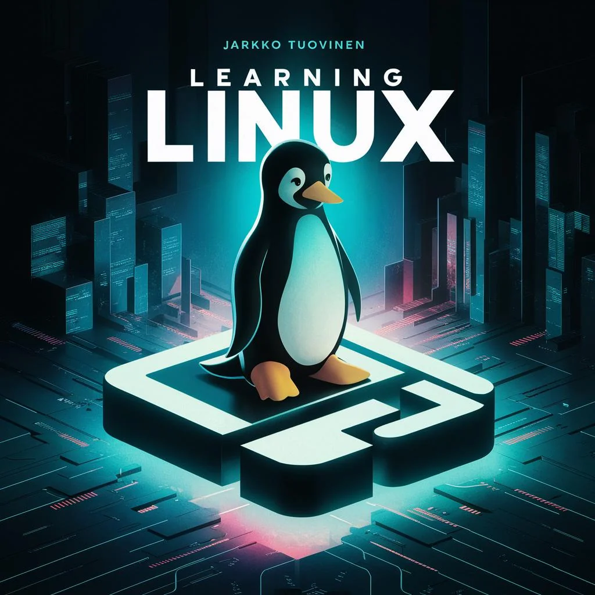

> [!TIP]
> Within any chapter, the table of contents can be accessed by pressing the unordered list icon  on top the right corner.

# First steps in learning Linux

Have you thought about trying a Linux operating system without knowing where to start? Or already tried, but encountered challenges with the new operating system. Let this book guide your steps to learning Linux.

Knowing about the past helps understand how things are today. Let's start with [Chapter&nbsp;1](chapter/01-intro.md), which covers the history of Linux and the views and opinions of a few selected individuals. Or choose a topic of interest below.

----------------

### Table of contents

<!-- Start of auto generated content -->

Chapter 1 - History of Linux <a href="chapter/01-intro.md">↩</a>

- [1.1 Branching](chapter/01-intro.md#branching)
- [1.2 Quality of free and open-source](chapter/01-intro.md#quality-of-free-and-open-source)
- [1.3 Culture of open-source works](chapter/01-intro.md#culture-of-open-source-works)
- [1.4 Economic sustainability](chapter/01-intro.md#economic-sustainability)
- [1.5 Time-sharing](chapter/01-intro.md#time-sharing)
- [1.6 Philosophy of the GNU project](chapter/01-intro.md#philosophy-of-the-gnu-project)
- [1.7 The birth of GNU & Linux](chapter/01-intro.md#the-birth)
- [1.8 Linux distros aren’t just the kernel](chapter/01-intro.md#eight-pieces)
- [1.9 GNU General Public -license](chapter/01-intro.md#gnu-gpl)
- [1.10 UNIX or Unix-like](chapter/01-intro.md#unix-or-unix-like)
- [1.11 The GNU/Linux family](chapter/01-intro.md#distro-family)
- [1.12 The cost of GNU/Linux](chapter/01-intro.md#the-cost-of-gnu-linux)
- [1.13 Popularity of GNU/Linux desktop](chapter/01-intro.md#popularity-of-gnu-linux-desktop)
- [1.14 What's wrong with GNU/Linux](chapter/01-intro.md#whats-wrong-with-gnu-linux)
- [1.15 Why people switch to GNU/Linux](chapter/01-intro.md#why-switch)
- [1.16 Suggested distributions](chapter/01-intro.md#suggested-distributions)
  

Chapter 2 - Design priciples of Unix and its decendants <a href="chapter/02-basic.md">↩</a>

- [2.1 Introduction to the text interface](chapter/02-basic.md#introduction-to-the-text-interface)
- [2.2 Cut and paste](chapter/02-basic.md#cut-and-paste)
- [2.3 Text selection](chapter/02-basic.md#text-selection)
- [2.4 Directory structure](chapter/02-basic.md#directory-structure)
- [2.5 Shell environment](chapter/02-basic.md#shell-environment)
- [2.6 IO after startup](chapter/02-basic.md#io-after-startup)
- [2.7 Design tropes of unix shell utilities](chapter/02-basic.md#design-tropes-of-unix)
- [2.8 Textual formats](chapter/02-basic.md#textual-formats)
- [2.9 Binary formats](chapter/02-basic.md#binary-formats)
  

Chapter 3 - Commandline crash course <a href="chapter/03-basic-terminal.md">↩</a>

- [3.1 Clear the screen](chapter/03-basic-terminal.md#clear-the-screen)
- [3.2 Special character: dash (-)](chapter/03-basic-terminal.md#special-character-dash)
- [3.3 Command-line options](chapter/03-basic-terminal.md#command-line-options)
- [3.4 Navigating directories](chapter/03-basic-terminal.md#navigating-directories)
- [3.5 Finding executables](chapter/03-basic-terminal.md#finding-executables)
- [3.6 Special character: period (.)](chapter/03-basic-terminal.md#special-character-period)
- [3.7 Special character: backslash (\\)](chapter/03-basic-terminal.md#special-character-backslash)
- [3.8 Control characters](chapter/03-basic-terminal.md#control-characters)
- [3.9 Special character: space ( )](chapter/03-basic-terminal.md#special-character-space)
- [3.10 File types and file name extensions](chapter/03-basic-terminal.md#file-types-and-file-name-extensions)
- [3.11 Autocomplete](chapter/03-basic-terminal.md#autocomplete)
- [3.12 Some useful shortcuts](chapter/03-basic-terminal.md#some-keyboard-shortcuts)
  

Chapter 4 - Installing applications <a href="chapter/04-installing.md">↩</a>

- [4.1 Package management](chapter/04-installing.md#package-management)
- [4.2 Self-contained application formats](chapter/04-installing.md#self-contained-formats)
- [4.3 Dotdeb files](chapter/04-installing.md#dotdeb-files)
- [4.4 Tarball](chapter/04-installing.md#tarball)
- [4.5 Python applications](chapter/04-installing.md#python-applications)
- [4.6 Compiling from source](chapter/04-installing.md#compiling-from-source)
  

Chapter 5 - Links in the file system <a href="chapter/05-links.md">↩</a>

- [5.1 Drag and drop](chapter/05-links.md#drag-and-drop)
- [5.2 Symbolic and hard links](chapter/05-links.md#symbolic-and-hard-links)
- [5.3 Examples of links](chapter/05-links.md#examples-of-links)
  

Chapter 6 - Interoperability <a href="chapter/06-inter.md">↩</a>

- [6.1 Simple IPC Techniques](chapter/06-inter.md#ipc-techniques)
- [6.2 Classic shell IO](chapter/06-inter.md#classic-shell-io)
- [6.3 Sockets](chapter/06-inter.md#sockets)
  

Chapter 7 - Advanced terminal usage <a href="chapter/07-advanced-terminal.md">↩</a>

- [7.1 Multi tasking](chapter/07-advanced-terminal.md#multi-tasking)
- [7.2 When a program hangs up](chapter/07-advanced-terminal.md#program-hangs-up)
- [7.3 Expansions and quoting](chapter/07-advanced-terminal.md#expansions-and-quoting)
- [7.5 Square brackets: [...]](chapter/07-advanced-terminal.md#gnu-test)
- [7.6 Customizing the shell prompt](chapter/07-advanced-terminal.md#customizing-shell-prompt)
  

Chapter 8 - Text editors <a href="chapter/08-text-editors.md">↩</a>

- [8.1 Terminal-based text editors](chapter/08-text-editors.md#cli-text-editors)
- [8.2 Modern text editors](chapter/08-text-editors.md#gui-text-editors)
  

Chapter 9 - Access management <a href="chapter/09-multi-user.md">↩</a>

- [9.1 Introduction to shared computing](chapter/09-multi-user.md#multiuser-intro)
- [9.2 Identity (user + group)](chapter/09-multi-user.md#indentity)
- [9.3 Ownership (of files and directories)](chapter/09-multi-user.md#ownership)
- [9.4 Permission attributes (of files and directories)](chapter/09-multi-user.md#permission-attributes)
- [9.5 Single User Mode](chapter/09-multi-user.md#single-user-mode)
- [9.6 Remote use](chapter/09-multi-user.md#remote-use)
- [9.7 Editing sudo configuration](chapter/09-multi-user.md#edit-sudoers)
  

Chapter 10 - Appendix <a href="chapter/10-additional.md">↩</a>

- [10.1 Installing GNU/Linux](chapter/10-additional.md#installing-gnu-linux)
- [10.2 Additional tips with the terminal](chapter/10-additional.md#terminal-stuff)
- [10.3 Additional tips for the desktop interface](chapter/10-additional.md#desktop-stuff)
- [10.4 Encrypted password system](chapter/10-additional.md#edit-shadow)
  

<!-- End of auto generated content -->

----------------

### Release history

| Version | Date | Description |
| ---:| --- | --- |
| 1.0.3 | 15.05.2025 | [Second pdf edition updated](https://github.com/GitJit-max/learning-linux/releases/download/v1.0.3/learning-linux-v1.0.3.pdf) |
| 1.0.3 | 15.05.2025 | Major updates to git edition |
| 1.0.1 | 22.02.2025 | Minor updates to git edition |
| 1.0 | 28.06.2024 | Second pdf edition |
| 1.0 | 16.06.2024 | First github edition |
| 0.9 | 13.04.2021 | First pdf edition |

### Contribution guidelines

I would much appreciate any help with spell checking and proofreading.

### Petition

It is difficult to gain visibility on the internet without a financial investment. In many cases, commercial content overshadows free content, regardless of quality. And many platforms don't tolerate unpaid advertising. I encourage you all to tell about this book to people you know and don't know. I hope that the word of mouth message will reach as many potential readers as possible.

### License

Copyright © 2021-2025 Jarkko Tuovinen and learning-linux contributors

Except where otherwise noted, this work is licensed under:

[https://creativecommons.org/licenses/by-nc/4.0/](https://creativecommons.org/licenses/by-nc/4.0/)

