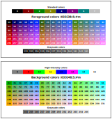

<!-- Start of auto generated content -->

> [!TIP]
> The table of contents can be accessed by pressing the unordered list icon  on top the right corner.

<p align="center">
  <a href="06-inter.md">&lt;&lt; Previous Chapter: 6 - Interoperability</a>
     |
  <a href="08-text-editors.md">Next&nbsp;Chapter:&nbsp;8&nbsp;&#8209;&nbsp;Text&nbsp;editors&nbsp;&gt;&gt;</a>
</p>

<!-- End of auto generated content -->

# Chapter 7 - Advanced terminal usage

Some parts of shell syntax (notably its quoting and statement-syntax rules) can be very confusing. These drawbacks generally relate to compromises in the programming-language part of the shell's design made to preserve its utility as an interactive command language interpreter. [^raymond-sshheell] To see how difficult things can get, take a look at [Bash Pitfalls](https://mywiki.wooledge.org/BashPitfalls), a page dedicated to common mistakes made by bash users.

<a id="multi-tasking"></a>

## 7.1 Multi tasking

**Multitasking** is the ability of a system to run multiple programs or tasks (seemingly) at the same time. Because a microprocessor can work with much smaller units of time than people can perceive, concurrent processes appear to be occurring simultaneously. Concurrent processing built into Unix, was a significant advantage over, for example, MS-DOS, which never had multitasking.

<!--A computer operation in which two or more processes (programs) have access to the microprocessor's time and are therefore carried out nearly simultaneously. Because a microprocessor can work with much smaller units of time than people can perceive, concurrent processes appear to be occurring simultaneously but in reality are not.

It allows the processor to switch between tasks quickly, making it seem like everything is happening simultaneously.

Multi tasking is a form of processing, supported by most current operating systems, in which a computer works on multiple tasks-roughly, separate "pieces" of work-seemingly at the same time by parceling out the processor's time among the different tasks. Multitasking can be either cooperative or preemptive. In the former, the operating system relies on the task to voluntarily cede control to another task; in the latter, the operating system decides which task receives priority.-->

### The concept of multiple windows

The concept of windows on a computer desktop is a core feature of multitasking in modern operating systems. By allowing multiple windows to be open simultaneously, users can perform various tasks at the same time, such as writing an email in one window, browsing the web in another, and editing a document in yet another. This is one way of running programs concurrently.

### Virtual terminals

The terms virtual console and terminal emulator refer to a unix-type way of dividing a physical console into several virtual consoles, each of which can run its own programs. <!--This allowed multiple programs to be run simultaneously. Multitasking was a significant advantage over, for example, MS-DOS, which was never multitasking,--> This is one way of running programs concurrently.

GNU/Linux still typically provides about 7 virtual TTY (teletype) terminals. You can use keyboard shortcuts ` Ctrl + Alt + F# ` to switch between the seven TTYs. TTYs can be seen as a basic form of multitasking. Each TTY provides an independent text-based interface where users can perform different tasks simultaneously. While they are not graphical windows (like those in a desktop environment), they still allow multiple sessions and processes to run independently. <!--Originally TTYs we were the command-line interface equivalent of a window in a graphical user interface. They allowed multiple sessions and processes to run simultaneously. --> On one TTY, you could keep open an instruction manual. One TTY could be busy executing a long-running process. And there were still several free interfaces for other concurrent use. Even today, TTYs can be very useful if, for example, a graphical desktop environment becomes unresponsive.

> [!WARNING]
> One of the virtual TTY terminals manages the graphical desktop environment. And you can get back to it with the same keyboard shortcuts ` Ctrl + Alt + F# `, if you know or guess the right TTY number. You should check the TTY number of the graphical environment with ` $ who↵ ` before trying to switch to the textual TTY environment.

### Three ways to open a desktop application

Three different ways to open a desktop app (such as ` $ gedit `) from a terminal window:
1. **Detached:** ` $ nohup gedit [optional-text-file] > /dev/null &↵ `
    - This allows a process to continue running even after the terminal session that started it is closed.
2. **Background:** ` $ gedit [optional-text-file] &↵ `
    - A process in the background is immune from terminal keyboard input, including any attempt to interrupt it with ` Ctrl + C `. You can return the process to the foreground by ` $ fg %1↵ `.
3. **Foreground:** ` $ gedit [optional-text-file]↵ `
    - The process can be suspended by pressing ` Ctrl + Z `.
        - ` $ jobs↵ ` can be used to check if the program has stopped. 
        - ` $ fg %1↵ ` reinstates the program to foreground.
        - ` $ bg %1↵ ` restores execution to background.

> [!TIP]
> Moving a process from the foreground to the background is handy, if you launch a graphical program from the command line, but forget to place it in the background by appending the trailing ampersand `  & `.

<a id="program-hangs-up"></a>

## 7.2 When a program hangs up

Sometimes a computer will become sluggish or an application will stop responding. In this chapter, we will look at some of the tools available at the command line that let us examine what programs are doing and how to terminate misbehaving processes. [^shotts]

<a id="kill-signals"></a>

### Kill signals <!--update internal links if changed-->

There is a **` $ kill `** command, which (despite the name) doesn't necessary kill processes, but rather sends signals. Programs, in turn, listen for signals and may act upon them as they are received. The fact that a program can listen and act upon signals allows a program to do things such as save work in progress when it is sent a termination signal. Signals are one of several ways that the operating system communicates with programs.

#### If you want to terminate a process

a) Keyboard shortcut **` Ctrl + C ` politely asks the current process to terminate**. An **INT** (interrupt) signal is sent to the target process. This corresponds to **` $ kill -2 <PID>↵ `**. The target process can accept the termination request and clean itself up before leaving, or refuse to comply and not terminate at all. Many, but not all, command-line programs can be terminated using this technique.

b) Command **` $ kill -3 <PID>↵ ` politely asks the current process to terminate**. A signal **QUIT** is sent to the target process, and it shuts down if it is alive enough to receive the signal. The program may also intercept the signal and choose to ignore it.

c) Command **` $ kill -15 <PID>↵ ` politely asks the current process to terminate**. A signal **TERM** (terminate) is sent to the target process, and it shuts down if it is alive enough to receive the signal. The program may also intercept the signal and choose to ignore it.

d) Command **` $ kill -9 <PID>↵ ` immediately terminates the chosen process**. This signal is never sent to the target process like other signals. The **KILL** signal is sent to the operating system kernel, which terminates the process immediately. When a process is terminated this way, it is not given the opportunity to clean up or save work in progress. Thus, it may leave behind corrupted files. So this signal should only be used as a last resort when other termination signals fail (force close an unresponsive program).

#### If you want to pause a process

a) Keyboard shortcut **` Ctrl + Z ` politely asks the current process to suspend**. A **TSTP** (terminal stop) signal is sent to the target process. This corresponds to **` $ kill -20 <PID>↵ `**. When you succesfully suspend a process, you can do fancy things with it such as bring it back to the foreground (see [Section: Multi tasking](#multi-tasking)). The program may also intercept the signal and choose to ignore it.

b) Command **` $ kill -19 <PID>↵ ` immediately suspends the chosen process**. This signal is never sent to the target process like other signals. The **STOP** signal is sent to the operating system kernel, which stops the process immediately. When a process is suspended this way, it is not given the opportunity to ignore the command.

> [!TIP]
> You can see all the signals using ` $ kill -l↵ ` in terminal.

> [!NOTE]
> With ` $ kill ` you must have superuser privileges to send signals to processes that do not belong to you.

### Process ID

The kernel maintains information about each process to help keep things organized. Each process is assigned a **PID** number (short for Process ID). Like files, processes also have owners and user IDs.

#### Graphical user interface to find the PID number

Many distributions offer a *System Monitor* found some where in the *Desktop Menu* to find out the process ID numbers. This is the equivalent of *Task Manager* in Windows invoked by ` Ctrl + Alt + Del `.

#### Commands to find the PID number

The terminal will offer some alternatives to find the PID(s):
- ` $ pidof firefox↵ ` will list PID(s) of a specific executable
- ` $ ps↵ ` will list processes associated with the current terminal session.
- ` $ ps x↵ ` will list processes regardless of what terminal (if any) they are controlled by.
- ` $ ps aux↵ ` will show processes belonging to every user.

The fields are:
- **USER** = Owner of the process
- **TIME** = Amount of CPU time consumed by the process.
- **TTY** (Teletype) = Controlling terminal for the process.
    - ` ? ` Means there is no controlling terminal.
- **STAT** (Process State Codes) = Current status of the process
    - ` R ` Running
    - ` S ` Sleeping
    - ` T ` Stopped
    - ` I ` Idle
    - ` l ` Multithreaded
    - ` < ` High-priority
    - ` N ` Nice = Low-priority
    - ` s ` Parent process of a terminal session
    - ` + ` Foreground
    
### Process priority

Linux can run a lot of processes at a time, which can slow down the speed of some high priority processes and result in poor performance. To avoid this, you can tell your machine to prioritize processes as per your requirements. This priority is called **niceness** in Linux, and it has a value between -20 to 19. The lower the Niceness index, the higher the priority. The default value of all the processes is 0.
- To start a process with a niceness value other than the default value use: ` $ nice -n <nice value> process name↵ `
- If there is some process already running on the system, then you can re-nice: ` $ renice <nice value> -p <PID>↵ `

<a id="expansions-and-quoting"></a>

## 7.3 Expansions and quoting

### Word expansions [^tog-expansions]

[^tog-expansions]: [Open Group Base Specifications - Word Expansions, accessed 2025](https://pubs.opengroup.org/onlinepubs/9799919799/utilities/V3_chap02.html#tag_19_06)

**Expansions** are mechanisms that allow the shell to interpret and transform input text before executing commands. They make scripts and commands more powerful and flexible.

- [Brace expansion](https://pubs.opengroup.org/onlinepubs/9799919799/xrat/V4_xcu_chap01.html#tag_23_02_06) generates a sequence of strings. <!--which expands, for example, file{A,B,C}.c into the fields fileA.c, fileB.c, and fileC.c or file{1..3}.c into the fields file1.c, file2.c, and file3.c. -->
- [Tilde expansion](https://pubs.opengroup.org/onlinepubs/9799919799/utilities/V3_chap02.html#tag_19_06_01) expands ` ~ ` to the home directory of the current user or ` ~user ` to another user.
- [Arithmetic expansion](https://pubs.opengroup.org/onlinepubs/9799919799/utilities/V3_chap02.html#tag_19_06_04) evaluates arithmetic expressions.
- [Parameter expansion](https://pubs.opengroup.org/onlinepubs/9799919799/utilities/V3_chap02.html#tag_19_06_02) expands variables and allows modifications.
- [Command substitution](https://pubs.opengroup.org/onlinepubs/9799919799/utilities/V3_chap02.html#tag_19_06_03) substitutes the output of a command.
- [Pathname expansion](https://pubs.opengroup.org/onlinepubs/9799919799/utilities/V3_chap02.html#tag_19_06_06) expands wildcards (globbing) to match file or directory names.

> [!NOTE]
> Shells are not required to implement brace expansion. This form of expansion is allowed but not required by IEEE 1003.1 standard. But if brace expansion is supported, it must be performed before all of the standard word expansions.

### Quoting [^tog-quoting]

[^tog-quoting]: [Open Group Base Specifications - Quoting, accessed 2025](https://pubs.opengroup.org/onlinepubs/9799919799/utilities/V3_chap02.html#tag_19_02)

Quoting is used to remove the special meaning of certain characters or words to the shell. Quoting can be used to preserve the literal meaning of the special characters in the next paragraph, prevent reserved words from being recognized as such, and prevent parameter expansion and command substitution.
- Enclosing characters in [single-quotes](https://pubs.opengroup.org/onlinepubs/9799919799/utilities/V3_chap02.html#tag_19_02_02) ` '...' ` shall preserve the literal value of each character within the quotes and suppress all expansions. 
- Enclosing characters in [double-quotes](https://pubs.opengroup.org/onlinepubs/9799919799/utilities/V3_chap02.html#tag_19_02_03) ` "..." ` shall preserve the literal value of all characters within the quotes, with the exception of:
    - Dollar-sign ` $??? ` for parameter expansion
    - Dollar-sign ` ${...} ` for the other form of parameter expansion
    - Dollar-sign ` $((...)) ` for arithmetic expansion
    - Dollar-sign ` $(...) ` for command substitution
    - Backquotes `` `...` `` for the other form of command substitution
    - Backslash ` \? ` as escape character

### Suppressing expansions
    
The bash shell can perform expansions and substitutions (as show by examples below), which leads to the need to control it with quoting.
- Double quotes ` "..." ` suppress some expansions.
- Single quotes ` '...' ` suppress all expansions.

|   | Un <br>quoted | "Double" <br>quoted | 'Single' <br>quoted |
|:--- |:--- |:--- |:--- |
| **String:**<br>` text ` | <br>` text ` | <br>` text ` | <br>` text ` |
| **Brace<br>expansion:**<br>` {a,c} `<br>` {a..c} `<br>` {001..003} ` | <br><br>**` a c `**<br>**` a b c `**<br>**` 001 002 003 `** | <br><br>` {a,c} `<br>` {a..c} `<br>` {001..003} ` | <br><br>` {a,b} `<br>` {a..c} `<br>` {001..003} ` |
| **Tilde<br>expansion:**<br>` ~ ` | <br><br>**` /home/albert `** | <br><br>` ~ ` | <br><br>` ~ ` |
| **Arithmetic<br>expansion:**<br>` $((2+2)) ` | <br><br>**` 4 `** | <br><br>**` 4 `** | <br><br>` $((2+2)) ` |
| **Parameter<br>expansion:**<br>` $USER `<br>` ${USER} ` | <br><br>**` albert `** | <br><br>**` albert `**<br>**` albert `** | <br><br>` $USER `<br>` ${USER} ` |
| **Command<br>substitution:**<br>` $(uname ‑o) `<br>`` `uname ‑o` `` | <br><br>**` GNU/Linux `**<br>**` GNU/Linux `** | <br><br>**` GNU/Linux `**<br>**` GNU/Linux `** | <br><br>` $(uname ‑o) `<br>`` `uname ‑o` `` |

<!--|   | Example | Un<br>quoted | "Double" <br>quoted | 'Single' <br>quoted |
|:--- |:--- |:--- |:--- |:--- |
| Simple string | text | text | text | text |
| Filepath and **tilde expansion** | ~/\*.txt | **/home/margaret/\*.txt** | ~/\*.txt | ~/\*.txt |
| **Brace expansion** | {a,b}<br>{001..003} | **a b**<br>**001 002 003** | {a,b}<br>{001..003} | {a,b}<br>{001..003} |
| **Command substitution** | $(uname ‑o)<br>\`uname ‑o\` | **GNU/Linux**<br>**GNU/Linux** | **GNU/Linux**<br>**GNU/Linux** | $(uname ‑o)<br>\`uname ‑o\` |
| **Arithmetic expansion** | $((2+2)) | **4** | **4** | $((2+2)) |
| **Parameter expansion** | $USER | **margaret** | **margaret** | $USER |-->

> [!TIP]
> You can use the *display text* commands ` $ echo ` and ` $ printf ` to learn see the world as the shell sees it:
>
> ```
> $ echo {a..c}↵
> a b c
>
> $ printf "%s\n" {a..c}↵
> a
> b
> c
> ```

<a id="gnu-test"></a>

## 7.5 Square brackets: [...]

There is a special [GNU test](https://www.gnu.org/software/coreutils/manual/coreutils.html#test-invocation) command to perform a variety of checks and comparisons. It has two equivalent forms: ` $ test <expression>↵ ` and ` $ [ <expression> ]↵ `. It is interesting to note that both ` $ test ` and ` $ [ ` are actual filenames. There is actually an executable named ` [ ` in the ` /usr/bin/ ` directory. The expression is actually just the arguments for the ` $ [ ` command. That's why a space character is required after. Likevise the ` ] ` is simply a required final argument. Also that's why a space character is required before the ` ] ` argument.

The commands return an exit status of 0 if the expression is true, 1 if the expression is false, or 2 if an error occurred. Nothing gets printed on the screen though. The shell provides a parameter ` $? ` that we can use to examine the exit status. Or one can construct some form of if-then-clause.

```
$ [ $USER == margaret ] && echo true || echo false↵
$ test $USER == margaret && echo true || echo false↵
true

$ [ $USER == edvard ] && echo true || echo false↵
$ test $USER == edvard && echo true || echo false↵
false

$ [ $USER == margaret ]↵
$ test $USER == margaret↵
$ echo $?↵
0

$ [ $USER == edvard ]↵
$ test $USER == edvard↵
$ echo $?↵
1
```

<a id="customizing-shell-prompt"></a>

## 7.6 Customizing the shell prompt

When used interactively, the shell prompts with the value of ` PS1 ` before reading a command. If at any time a newline ` \↵ ` is typed and further input is needed to complete a command then the secondary prompt ` PS2 ` is issued. It is possible to customize these default shell prompts.

Let's examine the default ` PS1 ` prompt in Solus ` $ echo $PS1↵ `:

| Code | Function |
|:--- |:--- |
| \\\[  \\033[**38;5;081**m  \\\] | Will change color to aqua |
| \\u | Current username |
| \\\[  \\033[**38;5;245**m  \\\] | Will change color to grey |
| @ | Simply the at sign |
| \\\[  \\033[**38;5;206**m  \\\] | Will change color to fuchsia |
| \\H | Current hostname |
| \\\[  \\033[**38;5;245**m  \\\] | Will change color to grey |
| \\w | Current working directory |
| \\\[  \\033[**38;5;081**m  \\\] | Will change color to aqua |
| $ | Simply the dollar sign |
| \\\[  **\\e[0m**  \\\] | Removes all attributes (formatting and colors). |

> [!NOTE]
> Note that **` \[ `** begins a sequence of non-printing characters (like color escape sequences) and **` \] `** ends a sequence of non-printing characters.

### Modifying the default prompt

Lets replace the default PS1 with something different:

```
$ export PS1='[\D{%d/%m/%Y %H:%M:%S} \u@\h \W]§'↵
[16/06/2024 18:34:38 margaret@mamas-machine ~]§

# The PS2 on Solus could use some colour and a space at the end:
$ export PS2='\[\033[38;5;081m\]> \[\e[0m\]'↵
```

> [!NOTE]
> Any change to PS1 or PS2 will vanish as the shell session ends. To make the change permanent, add the export command to a new line on ` ~/.bashrc ` for user specific preference, or ` /etc/profile ` for system wide preference.

### Special prompt variables [^ss64]

[^ss64]: [SS64 - How to setup prompt statement variables, accessed 2021](https://ss64.com/bash/syntax-prompt.html)

- ` \$ ` = The default bash prompt sign.
    - Dollar sign $ for regular access.
    - Hash mark # for continuous root access.
- ` \u ` = The username of the current user
- ` \H ` = The full hostname (such as deckard.SS64.com)
- ` \h ` = The hostname, up to the first dot (such as deckard)
- ` \w ` = Current directory (full path)
- ` \W ` = Current directory (without the parent directories)
- ` \l ` = The basename of the shell's terminal device name
- The time
    - ` \t ` = in 24-hour HH\:MM\:SS format
    - ` \T ` = in 12-hour HH\:MM\:SS format
    - ` \@ ` = in 12-hour AM\:PM format
- ` \n ` = Newline
- ` \r ` = Carriage return
- ` \a ` = Bell character
- ` \\ ` = Backslash
- ` \nnn ` = Character with corresponding ASCII code (nnn = octal value)
- ` \! ` = History number of this command
- ` \# ` = Command number of this command
- ` \D{...} `
    - ` %a ` = (la) = Day (abbreviated name)
    - ` %A ` = (lauantai) = Day (full name)
    - ` %b ` = (helmi) = Month (abbreviated name)
    - ` %B ` = (helmikuu) = Month (full name)
    - ` %d.%m.%Y ` = (20.02.2021) = Day, Month, Year
    - ` %H:%M:%S ` = (10\:15\:59) = Hours, Minutes, Seconds
    - E.g. ` \D{%H:%M %A %d.%m.%Y} ` = 10\:15 lauantai 20.02.2021

For more bells and whistles visit:
- <https://misc.flogisoft.com/bash/tip_colors_and_formatting>
- <https://stackoverflow.com/questions/4842424/list-of-ansi-color-escape-sequences>

### 8-bit (256) colors [^wiki-ansi]

Most terminal emulators understand the 8-bit color palette:



[^wiki-ansi]: [Wikipedia - ANSI escape code, accessed 2024](https://en.wikipedia.org/wiki/ANSI_escape_code)

The numbering in 8-bit color palette is arranged so that:
- Range ` 0x00-0x07 ` is for standard 8 colors.
- Range ` 0x08-0x0F ` is for additional 8 high intensity colors.
- Range ` 0xE8-0xFF ` is for grayscale from black to white in 24 steps.
- Range ` 0x10-0xE7 ` is for rest of the 216 colors. <!-- 6 × 6 × 6 cube = 16 + 36 × r + 6 × g + b where (0 ≤ r, g, b ≤ 5) -->

#### Examples of color use

Using these above, you can make pink text like so:

```
\033[38;5;206m     #That is, \033[38;5;<FG COLOR>m
```

And an early-morning blueish background like so:

```
\033[48;5;57m      #That is, \033[48;5;<BG COLOR>m
```

The above foreground and background be combined like so:

```
\033[38;5;206;48;5;57m  #That is, \033[38;5;<FG COLOR>;48;5;<BG COLOR>m
```

<!-- # References -->

[^shotts]: [William Shotts - The Linux Command Line, updated 2019](http://linuxcommand.org/tlcl.php)

[^raymond-sshheell]: [<!--Eric Steven Raymond - -->The Art of Unix Programming 2003, Chapter 14<!--. Languages-->, Section: Shell](http://www.catb.org/~esr/writings/taoup/html/ch14s04.html)

